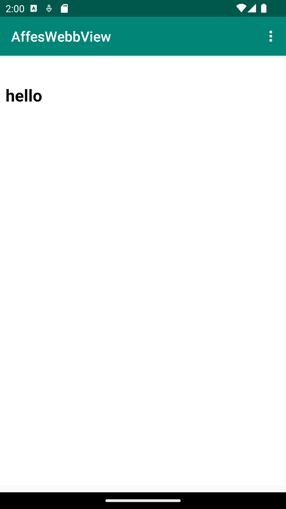

# Rapport
Det jag gjorde för denna uppgift var att först byta namnet på appen genom att gå in i "strings.xml"
filen under mappen "values" och där byta namnet på variabeln "app_name" till AffesWebbView.
```

    <string name="app_name">AffesWebbView</string>
    
```

Sedan lade jag till möjligheten för appen att komma åt internet genom att lägga till en "permission"
som säger till programmet att vi har tillåtelse att komma åt internet genom att skriva en "uses-permission"
tagg som visas nedan. Därefter gjorde jag en rad kod som sa "android:exported="true"" som krävs för att få 
detta att fungera i senare versioner av android.

```
    <uses-permission android:name="android.permission.INTERNET" />
    android:exported="true"
```
Sedan lade jag till en webview element genom att dra in den från paletten till design fönstret som
skapade följande kod
```
    <WebView
        android:layout_width="409dp"
        android:layout_height="673dp"
        tools:layout_editor_absoluteX="1dp"
        tools:layout_editor_absoluteY="57dp"
        android:id="@+id/my_webview"/>
```
Sedan gav jag min webview en ID genom att först ta bort "<textView>" taggen som användes för textviewn som jag tog bort
i samband med att jag skapade webviewn. Och sedan lade jag till ID i "<WebView>" elementet med hjälp av
följande rad kod.
```
    android:id="@+id/my_webview"
```
Efter detta så skapade jag en "private member variable" vid namn myWebView i "MainActivity.java" filen som jag sedan
initierade i onCreate samtidigt som jag uppfyllde nästa del av uppgiften som var att lokalisera detta webview element.
Detta gjordes med denna kod.
```
    private WebView myWebView;
    
    myWebView = findViewById(R.id.my_webview);
```
Efter detta så skapade jag en ny webview client som jag sedan satta fast min webview till genom att
lägga till koden nedan.

```
    myWebView.setWebViewClient(new WebViewClient());

    myWebView.setWebViewClient(new WebViewClient());
```
Därefter så enablade jag javascript execution i min webview client med hjälp av getSettings och setJavaScriptEnabled(true).
Jag hade lite problem med "setJavaScriptEnabled(true)" funktionen ett tag då jag från början tänkte fel och tänkte att det skulle vara
"getJavaScriptEnabled(true)" precis som det var med "getSettings"
```
     myWebView.getSettings().setJavaScriptEnabled(true);
```
Att lägga till min internal webpage hade jag mer problem med än något annat i denna uppgift.
Jag började med att lägga till en ny direktory som jag döpte till assets och i denna så skapade jag
en ny html sida som jag sedan gjorde en simple "h1" tagg för att bara ha någonting på sidan.
Problemet som jag stötte på var att min text inte syntes på sidan vilket fick mig att tro att jag
hade gjort något fel vilket i sin tur fick mig att gå igenom texten i dokumentet för att se om det
var något fel i html sidan och till och med försöka göra om hela processen från början igen genom
att ta bort sidan helt och göra en ny men inget jag gjorde värkade funka.
Till slut insåg jag att texteen fanns där den var bara gömd under headern av appen så jag gjorde en
simple style tagg med en margin på min då "h2" tagg vilket fick texten att bli synlig på sidan igen.
Sedan implementerade jag den interna webpagen på samma sätt som den externa med hjälp av en 
"loadUrl" funktion.
```
    <html>
    <style>
    h2{
        margin-top:100px;
       }
    </style>
    <body>
        <h2>
            hello
        </h2>
    </body>
</html>

public void showInternalWebPage(){myWebView.loadUrl("file:///android_asset/internal.html");
    }
```
Jag implementerade mina external och internal webpage på samma sätt med hjälp av loadUrl
```
    public void showExternalWebPage(){myWebView.loadUrl("https://his.se");}
    
    public void showInternalWebPage(){myWebView.loadUrl("file:///android_asset/internal.html");}
```
För att kalla på de olika webpage när man klickar på respektive i dropdown menyn så lade jag till
de olika funktionerna "showExternalWebPage();" och "showInternalWebPage();" under sina respektive
if satser i "onOptionsItemSelected" funktionen.
```
     if (id == R.id.action_external_web) {
            Log.d("==>","Will display external web page");
            showExternalWebPage();
            return true;
        }

        if (id == R.id.action_internal_web) {
            Log.d("==>","Will display internal web page");
            showInternalWebPage();
            return true;
        }
```




